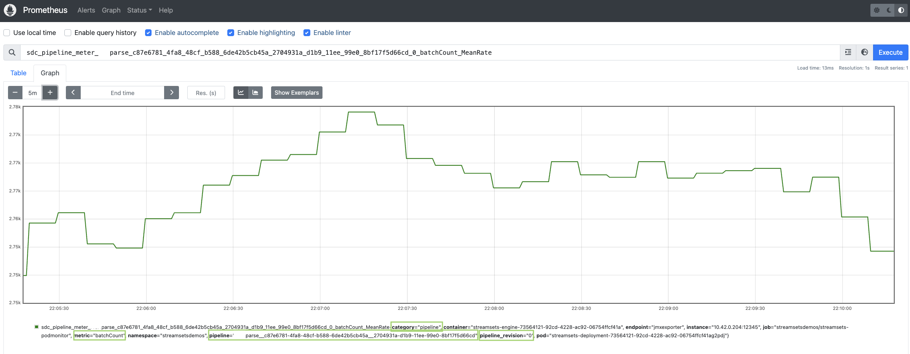

k8s-prometheus-jmx-exporter
=======================================

Sample to add a JMX-exporter to your SDC in Kubernetes
- See relevant JMX StreamSets doc at: [JMXMetrics-EnableExternalTools](https://docs.streamsets.com/portal/datacollector/latest/help/datacollector/UserGuide/Configuration/JMXMetrics-EnableExternalTools.html)
- See relevant Prometheus JMX exporter doc at: [GitHub - Prometheus jmx_exporter](https://github.com/prometheus/jmx_exporter)

## JMX exporter config

__NOTE__: The JMX exporter config [config-sdc.yaml](./jmx_exporter_configs/config-sdc.yaml) will currently export the collector metrics as follow:

- Pipeline level metrics:
  - prefix "sdc_pipeline_counter" (counts)
  - prefix "sdc_pipeline_meter" (rates… 1 min, 5 min, 15 min, average)
- Stages within pipelines:
  - prefix "sdc_pipeline_stage_counter" (counts)
  - prefix "sdc_pipeline_stage_meter" (rates… 1 min, 5 min, 15 min, average)
- the JVM metrics (threads, memory, CPUs, etc…)
  - prefix "sdc_jvm" (rates… 1 min, 5 min, 15 min, average)

See for example a sample "BatchCount - MeanRate" metric for a pipeline:

<p align="center">
  
</p>

## Kubernetes assets

### Deploy core supporting assets


Config map for the exporter config:

```sh
kubectl create configmap streamsets-jmxexporter-configs \
    --namespace streamsetsdemos \
    --from-file=config.yml=./jmx_exporter_configs/config-sdc.yaml
```

If you need to recreate the config map, you'll need to first delete it...do it as so:

```sh
kubectl delete configmap streamsets-jmxexporter-configs --namespace streamsetsdemos
```

### Prometheus Assets

__INFO__: Knowledge of Prometheus is valuable here... as this piece might depend on your setup...

Pod monitor for Prometheus to discover the StreamSets pods (this will not run if you don't have the prometheus stack installed, since it relies on the Prometheus CRD - monitoring.coreos.com)

```sh
kubectl --namespace streamsetsdemos apply -f ./manifests/pod-monitor.yaml
```

__NOTE__: Our pod monitor has the label "prometheus: scrape" to facilitate being selected by the Prometheus engine. You should make sure the Prometheus deployment is set to select all the pod monitors with this labels.

### New StreamSets dpeloyment YAML

The deployment file contains the following customization, in addition to the usual StreamSets items:
- initContainers to copy the jmx-exporter java agent into the collector
- volumes and volume mounts to help achieve that
- add new containerPort entry with name "jmxexporter"

The content of the file [deployment-jmxexporter-template.yaml](./manifests/deployment-jmxexporter-template.yaml) should be added to the StreamSets deployment

__IMPORTANT__: Don't add "blindly"... best is to compare it with the deployment you already have, and add only the relevant pieces.

## StreamSets settings

### Enable JMX exporter via JVM configs

Now all the Kubernetes assets are added and available, we need to enable the exporter agent in the StreamSets engine...

In deployment > advanced configurations > JAVA configuration > field "Java Options", add:

```sh
-javaagent:/jmxexporter/jmx_prometheus_javaagent.jar=12345:/jmxexporter_configs/config.yml
```

And make sure to restart the engine!!

Verify by running the following request from the StreamSets collector container...

```sh
curl http://localhost:12345/metrics
```

This should return a long list of metrics in the expected format.

### Optional - Enable jmxremote

You can expose the JMX objects in order to browse and build your JMX-exporter config for example:

```sh
-Dcom.sun.management.jmxremote -Dcom.sun.management.jmxremote.port=10099 -Dcom.sun.management.jmxremote.rmi.port=10099 -Djava.rmi.server.hostname=localhost -Dcom.sun.management.jmxremote.local.only=false -Dcom.sun.management.jmxremote.authenticate=false -Dcom.sun.management.jmxremote.ssl=false
```

__NOTE__: __This is not needed by the setup__! This is just for browsing of the JMX metrics if you want to see what's out there and update / enhance the jmx-exporter configs [config-sdc.yaml](./jmx_exporter_configs/config-sdc.yaml) for example
